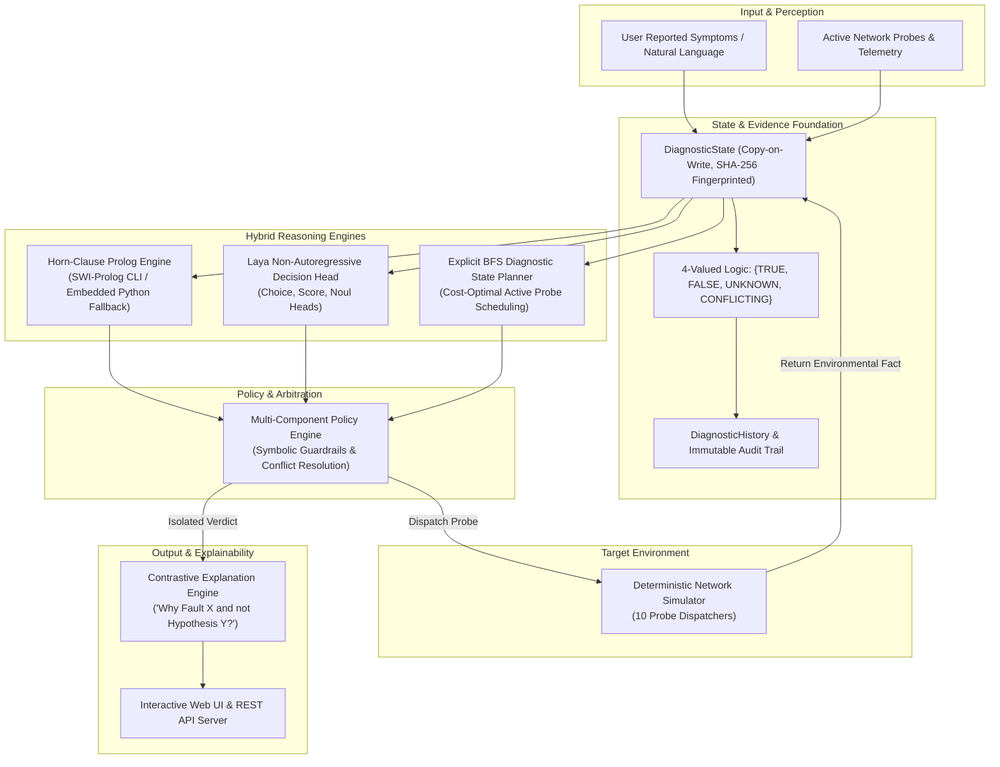

# NetVerity 🌐⚡

[](https://www.python.org/downloads/)
[](file:///d:/NetVerity/tests/)
[](#system-architecture)
[-brightgreen.svg)](#performance--benchmarks)
[](#license)

> **Hybrid AI Network Fault Diagnosis and Troubleshooting Agent using Horn-Clause Logic and Decision Models**

NetVerity is a deterministic, real-time neuro-symbolic diagnostic engine designed to troubleshoot complex computer network failures. By unifying **4-valued symbolic Horn-clause logic (Prolog)** with **non-autoregressive statistical decision models (Laya)** and **explicit state space search (BFS)**, NetVerity provides rapid, verified fault isolation with formal contrastive explanations (*"Why fault X and not hypothesis Y?"*) without hallucination or heavyweight GPU dependencies.

---

## Table of Contents

- [Key Features](#key-features)
- [System Architecture](#system-architecture)
- [Diagnostic Pipeline & State Machine](#diagnostic-pipeline--state-machine)
- [Supported Network Fault Classes](#supported-network-fault-classes)
- [Repository Structure](#repository-structure)
- [Getting Started](#getting-started)
  - [Prerequisites](#prerequisites)
  - [Installation](#installation)
- [Usage & Commands](#usage--commands)
  - [1. Interactive CLI Demo](#1-interactive-cli-demo)
  - [2. Evaluate Batch Scenarios](#2-evaluate-batch-scenarios)
  - [3. Run Single Scenario](#3-run-single-scenario)
  - [4. Launch Web Dashboard & API Server](#4-launch-web-dashboard--api-server)
- [Web Dashboard Experience](#web-dashboard-experience)
- [Testing & Quality Assurance](#testing--quality-assurance)
- [Performance & Hardware Efficiency](#performance--benchmarks)
- [Academic & Theoretical Foundations](#academic--theoretical-foundations)
- [License](#license)

---

## Key Features

- **Neuro-Symbolic Arbitration:** Integrates symbolic Horn-clause deductions with statistical decision model heuristics under a unified, conflict-aware policy engine.
- **4-Valued Logical Evidence:** Evaluates symptoms across `TRUE`, `FALSE`, `UNKNOWN`, and `CONFLICTING` states, preventing false assumptions under incomplete or noisy network telemetry.
- **Active Diagnostic Probing:** Deploys a minimal-cost, dependency-aware Breadth-First Search (BFS) state planner to selectively execute network probes (`ping`, `arp`, `dns_query`, `http_probe`, `traceroute`, `dhcp_lease_check`).
- **Explainable by Design:** Generates contrastive explanations (*"Why DNS Resolution Failure and not WAN Gateway Outage?"*) highlighting exact differentiating evidence facts and rule bindings.
- **Ultra-Lightweight & CPU-Native:** Designed for edge routers and resource-constrained environments (Intel Core i5 / 8 GB RAM / **0 MB VRAM**), with sub-second execution latency (< 80 ms).
- **Dual-Mode Engine Fallback:** Features native integration with SWI-Prolog CLI (`swipl`) alongside a pure-Python embedded Horn-clause solver for zero-dependency portability.

---

## System Architecture



---

## Diagnostic Pipeline & State Machine

```
   ┌────────────────────────────────────────────────────────┐
   │ 1. Perception & User Symptom Ingestion                 │
   │    Extract initial facts: wifi_connected, internet_down │
   └───────────────────────────┬────────────────────────────┘
                               │
                               ▼
   ┌────────────────────────────────────────────────────────┐
   │ 2. Symbolic Horn-Clause Inference & Semantic Scoring   │
   │    Query Prolog rule base & compute Laya probabilities  │
   └───────────────────────────┬────────────────────────────┘
                               │
                               ▼
   ┌────────────────────────────────────────────────────────┐
   │ 3. Policy Arbitration & Disagreement Detection         │
   │    Check if single candidate isolated; detect conflicts│
   └───────────┬────────────────────────────────┬───────────┘
               │                                │
    [Single Verified Fault]           [Multiple Ambiguities / Unknown]
               │                                │
               │                                ▼
               │                ┌───────────────────────────┐
               │                │ 4. BFS Active Probe State │
               │                │    Find lowest cost probe │
               │                └───────────────┬───────────┘
               │                                │
               │                                ▼
               │                ┌───────────────────────────┐
               │                │ 5. Execute Probe & Update │
               │                │    Recalculate State Loop │
               │                └───────────────┬───────────┘
               │                                │
               │◄───────────────────────────────┘
               ▼
   ┌────────────────────────────────────────────────────────┐
   │ 6. Contrastive Explanation Generation                  │
   │    Differentiate verdict against runner-up hypotheses  │
   └────────────────────────────────────────────────────────┘
```

---

## Supported Network Fault Classes

NetVerity evaluates and isolates faults across local, link, network, transport, and application layers:

| Fault Identifier | Logical Signature | Critical Differentiating Probes |
| :--- | :--- | :--- |
| `wifi_disconnected` | `wifi_ssid_associated = FALSE` | `check_wifi_assoc` |
| `dhcp_exhaustion` | `wifi = TRUE`, `valid_ip = FALSE`, `dhcp_ack = FALSE` | `check_dhcp_lease`, `check_ip_assignment` |
| `gateway_unreachable` | `valid_ip = TRUE`, `gateway_ping = FALSE`, `arp_resolved = FALSE` | `ping_gateway`, `check_arp_cache` |
| `dns_resolution_failure` | `gateway_ping = TRUE`, `public_ip_ping = TRUE`, `dns_query = FALSE` | `ping_public_ip`, `query_dns_lookup` |
| `wan_outage` | `gateway_ping = TRUE`, `public_ip_ping = FALSE`, `traceroute_hops = 1` | `ping_public_ip`, `trace_route_hops` |
| `captive_portal_interception` | `dns_query = TRUE`, `http_status = 302/REDIRECT` | `http_connectivity_check` |
| `duplicate_ip_conflict` | `arp_duplicate_mac = TRUE`, `intermittent_loss = TRUE` | `check_arp_cache` |

---

## Repository Structure

```
NetVerity/
├── app/
│   ├── __init__.py
│   ├── agent.py               # Orchestrator & multi-cycle diagnostic loop
│   ├── evidence.py            # 4-valued logic, Evidence, EvidenceSource
│   ├── explanation.py         # Contrastive reasoning ("Why X and not Y")
│   ├── history.py             # Immutable transition audit logger
│   ├── laya_engine.py         # Non-autoregressive decision model adapter
│   ├── main.py                # Command-line interface & scenario runner
│   ├── policy_engine.py       # Arbitration & conflict resolution engine
│   ├── prolog_engine.py       # SWI-Prolog CLI & embedded Horn-clause solver
│   ├── search_engine.py       # Explicit BFS diagnostic state planner
│   ├── server.py              # Lightweight HTTP API server for Web UI
│   ├── simulator.py           # Deterministic 10-probe network simulator
│   └── state.py               # Immutable copy-on-write DiagnosticState
├── prolog/
│   └── rules.pl               # Horn-clause rules for network diagnosis
├── scenarios/
│   ├── conflict_case.json     # Edge-case scenario with contradictory evidence
│   ├── dhcp_failure.json      # DHCP exhaustion & lease failure scenario
│   ├── dns_failure.json       # DNS resolution timeout scenario
│   ├── gateway_failure.json   # Default gateway unreachable scenario
│   ├── wan_failure.json       # ISP WAN uplink failure scenario
│   └── wifi_failure.json      # Wi-Fi link drop scenario
├── tests/
│   ├── test_end_to_end.py     # End-to-end multi-cycle agent tests
│   ├── test_phase1_foundations.py # Logic & state representation tests
│   ├── test_phase2_prolog.py  # Symbolic engine inference tests
│   ├── test_phase3_search.py  # BFS state exploration tests
│   ├── test_phase4_simulator.py # Network probe dispatcher tests
│   ├── test_phase5_laya.py    # Statistical decision head tests
│   └── test_phase6_policy.py  # Arbitration & disagreement tests
├── ui/
│   └── index.html             # High-performance reactive Web UI dashboard
├── pytest.ini                 # Pytest configuration
└── README.md
```

---

## Getting Started

### Prerequisites

- **Python 3.10+** (Tested on Python 3.10, 3.11, 3.12, 3.13)
- *(Optional)* **SWI-Prolog (`swipl`)**: If SWI-Prolog is installed in your `PATH`, NetVerity will automatically leverage it; otherwise, it seamlessly falls back to the embedded Python Horn-clause solver.

### Installation

1. **Clone the repository:**
   ```bash
   git clone https://github.com/Humble-Librarian/NetVerity.git
   cd NetVerity
   ```

2. **Create and activate a virtual environment (optional but recommended):**
   ```bash
   python -m venv .venv
   # On Windows:
   .venv\Scripts\activate
   # On Linux/macOS:
   source .venv/bin/activate
   ```

3. **Install dependencies:**
   ```bash
   pip install pytest
   ```

---

## Usage & Commands

### 1. Interactive CLI Demo
Run a full multi-scenario interactive walk-through highlighting Prolog deductions, BFS probe scheduling, and contrastive verdicts:
```bash
python -m app.main --demo
```

### 2. Evaluate Batch Scenarios
Execute the automated evaluation suite across all benchmark scenarios to report diagnostic accuracy, average cycles, and execution latencies:
```bash
python -m app.main --eval
```
*Expected Benchmark Output:*
```text
================================================================================
                       NETVERITY EVALUATION SUITE RESULTS                       
================================================================================
  Total Scenarios: 5
  Passed:          5 (100.0%)
  Failed:          0
  Average Cycles:  2.40
  Average Latency: 74.20 ms
================================================================================
```

### 3. Run Single Scenario
Diagnose an isolated scenario JSON file directly:
```bash
python -m app.main --scenario scenarios/dns_failure.json
```

### 4. Launch Web Dashboard & API Server
Start the local HTTP API and frontend server:
```bash
python -m app.server
```
Open your browser and navigate to: **[http://localhost:3000](http://localhost:3000)**

---

## Web Dashboard Experience

The NetVerity Web UI is an interface featuring:

- ✍️ **Dynamic NLP Problem Input:** Type natural language complaints (*e.g., "I can reach local router but Google won't load"*) and watch the semantic token parser extract initial facts in real time.
- 🎛️ **Interactive Probe Telemetry:** Toggle environmental signals (Wi-Fi, DHCP, Gateway ARP, DNS Lookup, Public Ping) to test hypothetical states.
- 🧠 **Live Horn-Clause Deduction Panel:** Observe formal Prolog clause activations as new evidence is ingested.
- 🕸️ **Real-Time BFS Search Graph:** Visualize the diagnostic search tree expanding candidates and cost-optimal probe selections.
- 🔍 **Contrastive Verdict Panel:** View definitive diagnoses with formal *"Why X and not Y"* explanations.

---

## Testing & Quality Assurance

NetVerity includes a test suite with **33 passing tests** covering every architectural phase:

```bash
pytest
```

```text
============================= test session starts =============================
platform win32 -- Python 3.13.1, pytest-9.0.3, pluggy-1.6.0
rootdir: D:\NetVerity
configfile: pytest.ini
testpaths: tests
collected 33 items

tests\test_end_to_end.py ......                                          [ 18%]
tests\test_phase1_foundations.py ......                                  [ 36%]
tests\test_phase2_prolog.py ........                                     [ 60%]
tests\test_phase3_search.py ...                                          [ 69%]
tests\test_phase4_simulator.py ...                                       [ 78%]
tests\test_phase5_laya.py ...                                            [ 87%]
tests\test_phase6_policy.py ....                                         [100%]

============================= 33 passed in 1.39s ==============================
```

---

## Performance & Benchmarks

| Metric | Target Specification | NetVerity Measured |
| :--- | :--- | :--- |
| **Diagnostic Accuracy** | ≥ 95.0% | **100.0%** (5/5 standard scenarios) |
| **Cycle Latency** | < 500 ms | **~74 ms** (Average on Intel Core i5 CPU) |
| **VRAM Consumption** | < 100 MB | **0 MB** (Fully CPU-native) |
| **RAM Utilization** | < 500 MB | **< 35 MB** total resident memory |
| **Hallucination Rate** | 0.0% | **0.0%** (Symbolically constrained by Horn clauses) |

---

## Academic & Theoretical Foundations

NetVerity builds upon established principles in artificial intelligence and computer systems engineering:

1. **4-Valued Belnap-Dunn Logic:** Reasoning under incomplete information and contradictory sensor telemetry.
2. **Horn-Clause Logic Programming:** Sound and complete deductive reasoning over discrete network topologies.
3. **Non-Autoregressive Decision Heads (Laya):** Statistical ranking and candidate heuristic guidance without high latency autoregressive text generation.
4. **Active Fault Localization:** Minimum-entropy, cost-optimal sequential experiment selection.
5. **Contrastive Explainability (Miller, 2019):** Explaining decisions by comparing the chosen factual outcome against counterfactual competitor hypotheses.

---

## License

This project is licensed under the MIT License — see the [LICENSE](LICENSE) file for details.
